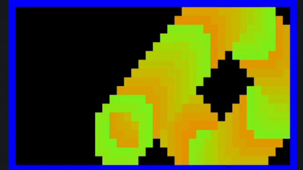

# Traphix

Traphix is a simple Go library for creating colorful terminal graphics using ANSI color codes. It provides functionality to draw shapes, lines, and circles with changing colors, allowing you to create dynamic and visually appealing patterns in the terminal.

<div align="center">
    
</div>

## Installation

To use Traphix in your Go project, you can install it with the following command:

```bash
$ go get -u github.com/rudransh61/traphix
```


## Example Usage

Here's a basic example of how to use Traphix to create a bouncing ball with changing colors:

```go
package main

import (
	"github.com/rudransh61/traphix"
	"time"
	"math"
)

func main() {
	// Create a window with size 40x20 and set the background color to black
	window := traphix.Screen(40, 20, 0, 0, 0)

	// Set the initial position and velocity of the ball
	ballX, ballY := window.Width/2, window.Height/2
	velocityX, velocityY := 1, 1

	// Loop to create the bouncing ball animation
	for {
		// Clear the screen for each frame
		window.ClearScreen()

		// Update the ball's position based on velocity
		ballX += velocityX
		ballY += velocityY

		// Bounce off the walls
		if ballX <= 0 || ballX >= window.Width-1 {
			velocityX = -velocityX
		}
		if ballY <= 0 || ballY >= window.Height-1 {
			velocityY = -velocityY
		}

		// Draw a colorful ball that smoothly changes colors
		rr := int(128 + 127*math.Sin(float64(time.Now().UnixNano()%1000000000)/1000000000.0))
		rg := int(128 + 127*math.Sin(float64(time.Now().UnixNano()%1000000000)/1000000000.0+2))
		rb := int(128 + 127*math.Sin(float64(time.Now().UnixNano()%1000000000)/1000000000.0+4))
		window.DrawCircle(ballX, ballY, 3, rr, rg, rb)

		// Print the window with the drawn ball
		window.PrintWindow()

		// Pause for a short duration to control the animation speed
		time.Sleep(50 * time.Millisecond)
	}
}
```

Feel free to explore the `traphix` package for more features and customization options.

## Contributing

If you have any ideas for improvements or find issues, feel free to open an [issue](https://github.com/rudransh61/traphix/issues) or submit a [pull request](https://github.com/rudransh61/traphix/pulls).

## License

This project is licensed under the MIT License - see the [LICENSE](LICENSE) file for details.
